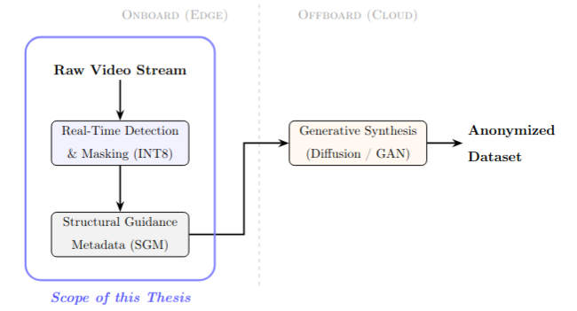

# Hardware-Aware AI Optimization for In-Vehicle Real-Time Applications 🚀

[](https://www.python.org/)
[](https://developer.nvidia.com/tensorrt)
[](https://opensource.org/licenses/MIT)

This repository contains the official implementation of the optimization pipeline developed for the Erasmus Mundus IPCVAI Master's Thesis. We bridge the gap between theoretical **Frugal AI** frameworks and low-level TensorRT compiler constraints to deploy high-fidelity **RF-DETR** perception models on resource-constrained automotive edge hardware (**NVIDIA Jetson AGX Orin**).

By bridging these layers, this project achieves a high-performance acceleration for real-time person-segmentation and anonymization.

---

## 🛠 Architectural Overview
We implemented a decoupled generative paradigm to ensure compliance while maximizing throughput:



### Key Engineering Interventions
* **Native QDQ Bridge:** A custom engineering solution that forces PyTorch into strict symmetric quantization compliance for NVIDIA TensorRT, completely eliminating optimization friction.
* **Algorithmic Stabilization:** Implements structural pruning and delayed strategies to prevent neural capacity collapse during training and optimization.
* **Mixed-Precision Routing:** Strategic execution utilizing optimized TensorRT precision to maximize edge throughput while ensuring full visual integrity.

---

---
## 📂 Repository Structure
* `only_train_once/`: The core GETA joint-optimization framework.
* `rf_detr/`: The modified Vision Transformer architecture.
* `scripts/`: Contains the complete end-to-end pipeline, evaluation tools, and auxiliary scripts:
  * `patches.py` & `qdq_layers.py`: Custom runtime monkey patches and layer structures.
  * `prune.py`: Deep graph surgery and structural pruning execution.
  * `export.py`: ONNX export pipeline for TensorRT compilation.
  * `evaluate.py`: Comprehensive evaluation pipeline for Bounding Box (`bbox`) and Segmentation (`segm`) COCO metrics.
  * `resnet18.py` (or your ResNet script name): Auxiliary script for running and benchmarking alternative ResNet18 configurations.
---

## 📊 Hardware Validation & Performance
Our optimization strategy successfully reduces compute overhead while maintaining complete visual fidelity and detection accuracy.

| Metric | FP16 Baseline | Optimized Production Model (FP16 Pruned) |
| :--- | :--- | :--- |
| **Inference Latency** | 6.61 ms | **2.22 ms** (~3x Speedup) |
| **Pipeline FPS** | 60.17 FPS | **72.26 FPS** |
| **Model Footprint** | Standard | Slightly Smaller (Reduced Memory Overhead) |
---

## 🚀 Quick Start
```bash
git clone [https://github.com/Shaima-Alshamiry/hardware-aware-rfdetr-geta.git](https://github.com/Shaima-Alshamiry/hardware-aware-rfdetr-geta.git)
cd hardware-aware-rfdetr
pip install --upgrade pip
pip install -r requirements.txt
```
# Step 1: applying geta and train the model
```bash
python3 scripts/train.py --train-subset 0.70 --val-subset 500 --epochs 20
```
# Step 2: Commit Structural Pruning and cleaning 
```bash
python3 scripts/prune.py --checkpoint ./checkpoints/geta_best.pth --output clean_pruned_rfdetr_lv.pth
```
# Step 3: Export to Clean Production ONNX
```bash
python3 scripts/export.py --model clean_pruned_rfdetr_lv.pth --output rfdetr_production_lv.onnx
```
# Step 4: Run Evaluation (COCO Metrics)
```bash
python3 scripts/evaluate_map.py --mode geta --weights clean_pruned_rfdetr_latest.pth --ann_file ./coco_data/annotations/instances_val2017.json --batch_size 32
```
# To Run ResNet18 Baseline Script (Optional)
```bash
python3 scripts/resnet18.py 
```
---


## GETA Framework

If you find the base optimization framework useful, please cite the original authors:

```bibtex

@article{qu2025automatic,

  title={Automatic Joint Structured Pruning and Quantization for Efficient Neural Network Training and Compression},

  author={Qu, Xiaoyi and Aponte, David and Banbury, Colby and Robinson, Daniel P and Ding, Tianyu and Koishida, Kazuhito and Zharkov, Ilya and Chen, Tianyi},

  journal={arXiv preprint arXiv:2502.16638},

  year={2025}

}
```
---

## 📜 Acknowledgements
This research was conducted as part of the Erasmus Mundus Master in Image Processing and Computer Vision (IPCVAI). 

I would like to express my sincere gratitude to my supervisor, Dr. Pedro, Brandimarte, for their invaluable guidance, mentorship, and support throughout this thesis. Special thanks to the team at **Vicomtech** for their industrial mentorship and providing the resources necessary for this research.
